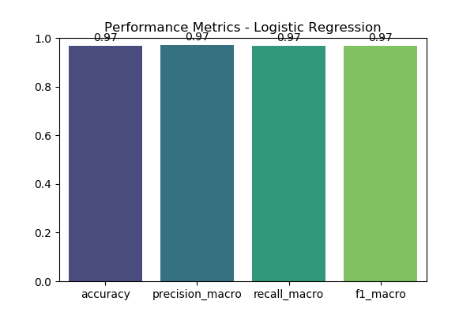
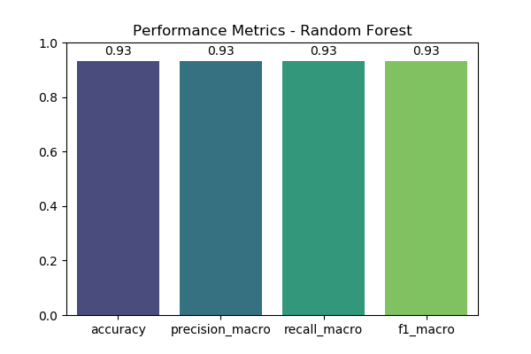
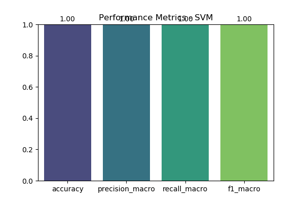

### mlops-assignment-1
### Introduction

This repository contains an MLOps assignment using the Iris dataset.
The goal is to train several machine learning models, compare their performance, log results, and save the trained models.

### Problem statement

Given the measurements of iris flowers (sepal length, sepal width, petal length, petal width), the task is to classify each sample into one of three species: Setosa, Versicolor, or Virginica.
This is a standard multiclass classification problem used to demonstrate training, evaluation, and model management.

### Dataset description

Dataset: Iris (from sklearn.datasets.load_iris)

#Samples: 150

# Features (4):

sepal length (cm)

sepal width (cm)

petal length (cm)

petal width (cm)

### Target (3 classes):

0 = setosa

1 = versicolor

2 = virginica

#Properties: small, balanced, well suited for quick experiments and model comparison.

### Model selection

I train and compare three models chosen for simplicity and diversity of approach:

##Logistic Regression

Type: linear model

Typical use: baseline for classification problems

Hyperparameters used: solver="liblinear", C=1

##Random Forest

Type: ensemble tree-based model

Typical use: strong performance on tabular data, handles nonlinearities

Hyperparameters used: n_estimators=30, max_depth=3, random_state=42

##Support Vector Machine (SVM)

Type: margin-based classifier

Typical use: works well for small to medium datasets

Hyperparameters used: kernel="linear", probability=True, random_state=42

These models give a mix of linear, ensemble, and kernel-based approaches so we can compare behavior and robustness.


## MLflow Logging Screenshots

The following images show experiment tracking, evaluation metrics, and confusion matrices for different models:

- **Logistic Regression Performance**  
  

- **Random Forest Performance**  
  

- **SVM Performance**  
  

- **Logistic Regression Confusion Matrix**  
  

- **Random Forest Confusion Matrix**  
  

- **SVM Confusion Matrix**  
  

---

## Model Registration Screenshot

The following image shows the model registration step in MLflow:


## How to Run the Project

### 1. Clone the Repository
```bash
git clone https://github.com/your-username/mlops-assignment-1.git
cd mlops-assignment-1

### 2. Create and Activate Virtual Environment

It is recommended to use conda or venv.
conda create -n mlops python=3.10 -y
conda activate mlops

**for venv**
python -m venv mlops
source mlops/bin/activate    # Linux/Mac
mlops\Scripts\activate       # Windows


### 3. Install Dependencies
pip install -r requirements.txt


### 4. Train Models and Log with MLflow
python src/train_models.py


### 5. Launch MLflow UI
mlflow ui #in terminal